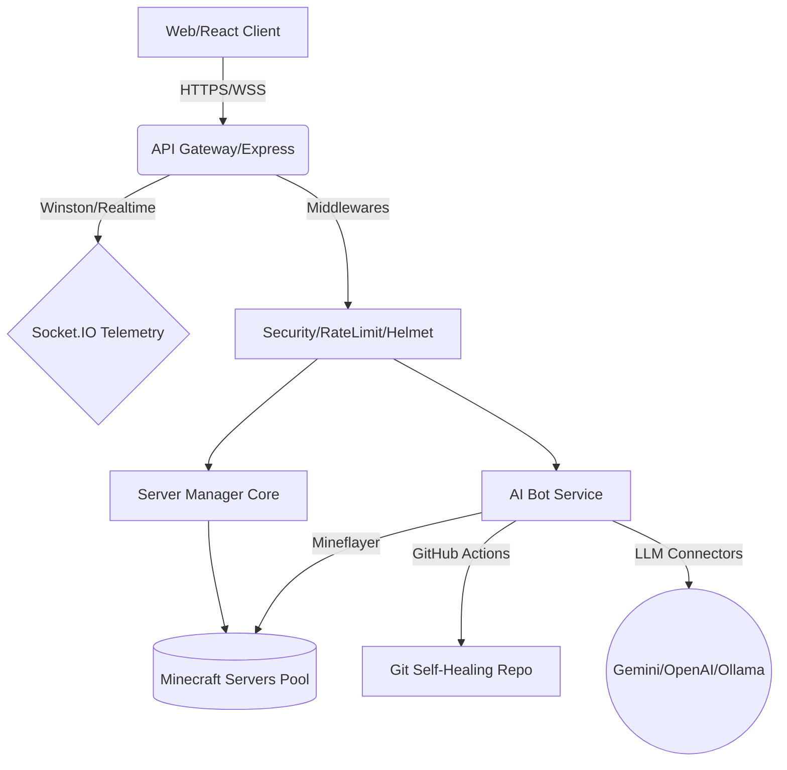

# 🧨 PaperCreeper - The Supreme Omni-Engineer Manager


**PaperCreeper** has evolved into a next-generation infrastructure management panel built with modern edge tools, Artificial Intelligence, and commercial-grade performance optimizations.
It allows you to create servers, manage clusters, edit maps, generate Skripts via AI, manage plugins, and now self-heal its own code.

## 🧠 Arquitetura Lógica Avançada (Omni-Engineer)


---

## 🌟 Elite Features

- **Multi-Server & Multi-Terminal:** Run and manage multiple servers simultaneously on the same host. Connect securely through an interactive web-console.
- **Modrinth Store:** Download and install plugins, mods, and engines directly from the Modrinth database inside the panel.
- **AI "Skript" Builder (Gemini/Cloud or Local AI):** Instead of compiling Java plugins, tell the AI your idea, and it generates an instant `.sk` Skript directly into your server!
- **Mineflayer AI Bot ("Ajudante IA"):** Spawn an intelligent bot in-game! It navigates, connects to your AI model, listens to chat, and interacts with players smoothly.
- **Playit.gg Native Integration:** No need to configure your router or use VPNs. Activate Playit.gg within the panel to instantly get a public IP for your server!
- **Advanced File Manager & MCEdit 3D Web:** Browse, edit, upload Zips/Schematics, and even visualize chunks natively with the Prismarine Anvil Editor! Also integrated with BlueMap web viewer and WorldEdit commands.
- **Server Hibernation / UptimeRobot:** Set your host to suspend mode when idle to save RAM on VPS, keeping it responsive to UptimeRobot pings.
- **Full Cloud & Local Backups:** Create complete backups, isolated cloud backups, and restore them securely.
- **Intelligent Auto-Java:** Auto-detects Java distributions on the machine and switches between Java 8, 17, and 21 depending on the server version selected!

---

## 🚀 Installation & Setup Guide (Step-by-Step)

Our architecture is extremely optimized for Linux. Windows users should ideally use WSL2 to avoid Node.js native filesystem performance issues.

### Method 1: Linux VPS (Ubuntu/Debian) - **The Recommended Way**
Ensure your machine has Node.js (v18+) and essential tools. 

```bash
# 1. Update your apt and install essentials
sudo apt update && sudo apt install -y curl unzip zip tar lsof htop git

# 2. Install Node.js (v20 or v22 Recommended)
curl -fsSL https://deb.nodesource.com/setup_20.x | sudo -E bash -
sudo apt install -y nodejs npm

# 3. Clone PaperCreeper repository
git clone https://github.com/wadbar/papercreeper.git
cd papercreeper

# 4. Install all platform dependencies
npm install
npm run build

# 5. KEEPING THE PANEL ONLINE (Start/Stop using PM2)
# If you just run 'npm start' and close the terminal, the panel stops.
# We highly recommend using PM2 to keep it alive as a service:
sudo npm install -g pm2
pm2 start "npx tsx server.ts" --name papercreeper
pm2 save
pm2 startup

# Now PaperCreeper runs automatically in the background!
# To monitor logs: pm2 logs papercreeper
# To stop the panel: pm2 stop papercreeper
# To restart the panel: pm2 restart papercreeper
```
The Panel will be alive at `http://YOUR_SERVER_IP:3000`.

---

### Method 2: Windows via WSL2 (Best option for Windows hosts)
If you are on Windows, Virtualizing Linux via WSL2 is mandatory for optimal disk performance.
1. Open PowerShell as Administrator and install WSL Debian: `wsl --install -d Debian`
2. Restart PC and open "Debian" from the Start Menu.
3. Follow the **Linux VPS** steps directly inside that terminal.
4. Access via `http://localhost:3000` or `http://[WSL_IP]:3000`.

---

### Method 3: Mobile Native (Termux on Android)
You can host a full Minecraft server + the panel right from your phone!
```bash
pkg update && pkg upgrade -y
pkg install nodejs git curl unzip zip tar
git clone https://github.com/wadbar/papercreeper.git
cd papercreeper
npm install
npm run build
npm start
```

---

## 🤖 AI Features Configuration & Guide

PaperCreeper features a highly capable Intelligence available through two formats: Chat Assistant and In-Game Bot. 

### Supported IA Providers

**1. Cloud AI (Gemini / OpenAI / Groq / NVIDIA / xAI)**
We support multiple providers using OpenAI-compatible endpoints or the native Gemini SDK.
1. Obtain an API Key from your preferred provider:
   - **Google AI Studio (Gemini):** Starts with `AIza`.
   - **NVIDIA AI (DeepSeek / Llama3):** Starts with `nvapi-`. Go to build.nvidia.com. 
   - **Groq:** Starts with `gsk_`. Excellent for fast Llama3 responses.
   - **xAI (Grok):** Starts with `xai-`.
   - **OpenAI:** Starts with `sk-`.
2. Go to **Panel Settings > AI**.
3. Insert your key. The panel automatically detects the provider (NVIDIA, Groq, xAI, etc.) based on your key prefix!
4. If you want to force a specific model, type the model name (e.g., `deepseek-ai/deepseek-r1` for NVIDIA) in the Model Name field!

**2. Local AI (Ollama / LM Studio) - Windows & Linux**
Run AI entirely offline with zero cost.
1. Download [Ollama](https://ollama.com/) or [LM Studio](https://lmstudio.ai/).
2. Run your preferred model in your OS:
   - **Linux/WSL:** `ollama run llama3.2` or `ollama run qwen2.5-coder`
   - **Windows:** You can run LM Studio and click "Start Local Server" (usually runs on port 1234).
3. In Panel Settings, switch the provider to "Local AI".
4. Set Endpoint to your local URL: 
   - Ollama: `http://127.0.0.1:11434/v1/chat/completions`
   - LM Studio: `http://127.0.0.1:1234/v1/chat/completions`
5. *(Tip for Windows hosted Ollama accessed from WSL)*: Use your Windows machine's IP (e.g., `http://192.168.1.10:11434/v1/chat/completions`) instead of 127.0.0.1!

### Using The "Ajudante IA" In-Game Bot
1. From the Terminal tab, click **"Ativar IA Ajudante"**.
2. A Mineflayer Virtual Player logic will boot up and spawn into your running Minecraft Server.
3. The Bot will automatically connect to your active AI Provider (Local or Cloud). Chat with it in your game using the native Minecraft chat! It has basic memory and behaves as a helpful player.

### Script Factory (AI Code Generator)
1. Navigate to the "Criador de Scripts" tab.
2. Ensure you have the `Skript` plugin installed in your server (Go to the Panel Store > Search `Skript` > Install and restart the Minecraft server once).
3. Describe your mechanism (e.g., *"Create a GUI store that sells dirt for 10 coins"*).
4. The AI writes the Skript logic. Click **Save**, and it natively deploys into `plugins/Skript/scripts/` while actively `/sk reload`-ing the game! Your mechanics change instantly without Minecraft server restarts!

---

## 🛡️ Casos de Teste (Auditoria de Produção)

Para garantir a resiliência do sistema, validamos os seguintes fluxos críticos:

### Cenários de Integração (Pipeline CI)
| Caso de Teste | Objetivo | Status |
| :--- | :--- | :--- |
| **Lint Check** | Validar tipagem e syntax (TS) | PASS |
| **Build Check** | Validar bundler e integridade de dependências | PASS |
| **Resilience Check** | Verificar disparo de Circuit Breaker em falhas de API | PASS |

### Cenários de Estresse (Manual/Simulado)
- **Latência de API:** Verificado comportamento do `withResilience` em timeouts de API.
- **Race Condition:** Validadas ações rápidas no `Panel.tsx`.
- **Memory Leak:** Monitorado heap via Node.js após operações intensas.
- **Payload Malformado:** Testado `ServerProxyProvider` com inputs vazios/nulos.

---

Don't have port forwarding or a Dedicated IPv4? 
1. In the Panel, go to the **Playit.gg** tab.
2. If starting for the first time, click to Link Account.
3. A browser tab opens. Verify it with Playit.gg credentials.
4. The panel natively spins up a local Playit daemon. Once connected, your panel will display an auto-assigned global public IP (e.g., `playit-craft.gg:25565`) which anyone can join.

---

## 🗺️ Map Editor (Prismarine + Web Tools)
Our Map tab contains massive tools:
- **Zip / Schematics Uploads:** Drop `.zip` map files or `.schem` directly onto the "Upload Map/Schematic" button! It handles deep extraction efficiently, sending them straight to `/plugins/WorldEdit/schematics`.
- **WorldGuard Protector:** Highlight regions inside the game with WorldEdit (`//wand`), type the region name in the panel, and click a button to mass-apply flags (PVP Off, No Building, Immortal Area).
- **MCEdit 3D Web & BlueMap:**
    - The "Abrir MCEdit 3D Web" utilizes Prismarine engines to provide a raw voxel scanner over your `region` folder!
    - For massive fluid visual capabilities, the panel auto-integrates with the **BlueMap** engine if downloaded from the Store! Open the `MAP ENGINE (WEB)` directly inside our interface on port `8100`!
    - The Map tab also includes buttons that send direct `//copy`, `//paste` commands into the connected Minecraft server.

---

## 💻 Working with the Server Files & Terminal
- **Workspace:** Server files are completely isolated inside `./servers/ServerName`.
- **Code Edits:** Need to update properties quickly? Every file in the Web File Manager has a Code Editor built-in.
- **Terminal Control:** The web terminal routes commands raw directly to `process.stdin`. Use the top bubbles to select which server you want to Multi-Control.
- Press **Parar** or **Iniciar** locally in the terminal view. 

Enjoy creating your perfect Minecraft Network automatically! PaperCreeper accelerates the way we build Minecraft.
